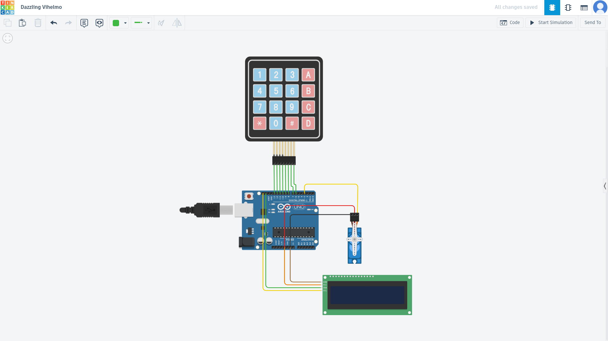
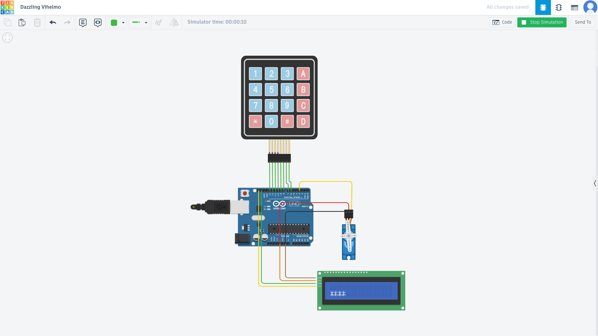

# FSM-Based Embedded Access Control System 🔐

An Arduino-based embedded door lock system built using a **Finite State Machine (FSM)**.  
The system authenticates users via a keypad, stores credentials in EEPROM, controls a servo-based locking mechanism, and enforces a security lockout after failed attempts.

---

## ✨ Features
- Finite State Machine (FSM)–based system design  
- 4×4 keypad PIN authentication  
- Masked PIN entry on LCD  
- EEPROM-based password persistence  
- Servo-controlled door lock  
- Lockout mechanism after multiple failed attempts  
- Non-blocking timing using `millis()`

---

## 🧠 FSM Design

This project’s behavior is structured around a Finite State Machine with the following states:

| State | Purpose |
|-------|---------|
| **IDLE** | Waiting for user input |
| **INPUT** | Collecting keypad characters |
| **VERIFY** | Comparing input with stored password |
| **ERROR** | Handling incorrect PIN attempts |
| **LOCKED_OUT** | Temporary lockout after failed attempts |

Using an FSM ensures predictable, deterministic control flow and makes it easier to reason about system behavior.

---

## 🛠️ Hardware Components
- Arduino Uno  
- 4×4 Matrix Keypad  
- Servo Motor  
- I2C LCD Display  

---

## 🔐 Security Highlights
- Input buffer overflow protection  
- EEPROM-backed credential storage  
- Rate limiting using lockout after failed attempts  
- Non-blocking timing logic for lockout enforcement  

---

## 🔑 Default Access Credentials

- **Default PIN:** `1234`  
- The PIN is stored in **EEPROM**, allowing it to persist across power cycles.  
- The default PIN is only written during initial EEPROM initialization and can be changed in future enhancements only if you use and not comment out the initEEPROM() in the code.

> ⚠️ **Note:** This default credential is provided for demonstration and testing purposes.

---

## 🧪 Simulation & Testing

This project was developed and tested using **Tinkercad Circuits**:

🔗 **Tinkercad Simulation (click to open):**  
https://www.tinkercad.com/things/4qVpwspqtIz-dazzling-vihelmo

You can run the simulation there to observe the system behavior:
- Enter the correct PIN (`1234`) ➜ door unlocks  
- Enter the wrong PIN repeatedly ➜ lockout state engages  

---

## 📸 Project Screenshots

### Circuit Overview

### Normal Operation

### Lockout State

---

## 🚀 Future Improvements
- Password change mode  
- EEPROM-backed lockout persistence  
- Interrupt-driven keypad input  
- Alarm / buzzer integration  

---

## 👤 Author
**Chirag**
